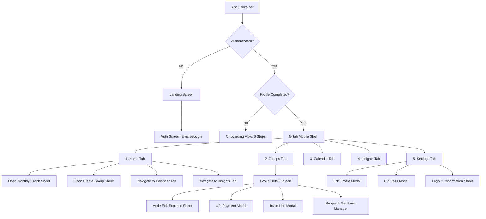

# Splitzy Design System

## 1. Design Philosophy

Splitzy is designed around **Tactile Claymorphism (Soft 3D)** paired with **Modern Minimalist Fintech Clarity**. Rather than harsh flat rectangles or heavy, distracting glassmorphism, Splitzy utilizes organic rounded surfaces, subtle dual-direction light/dark specular elevation shadows, and warm debossed (inset) interactive elements to create a calm, approachable, and tangible mobile expense experience.

### Overall Aesthetic
- **Tactile & Organic**: High border radii (`16px` to `32px`), soft dual-tone drop shadows mimicking physical clay or rubberized card tiles.
- **Calm & Non-Intimidating**: Financial applications often cause stress; Splitzy uses soft pastel tint badges (`primaryTint`, `emeraldTint`, `purpleTint`), friendly illustrated avatar tokens, and clear conversational messaging (e.g., *"Split fair. Settle smart."*, *"Good morning, Sarthak"*).
- **Physical Feel**: Buttons and cards physically respond to touch: pressed states transition from elevated drop shadows (`clayRaised`) to deep inset shadows (`clayPressed`) with micro-scale feedback (`active:scale-[0.97]`).

### Product Personality
- **Approachable**: Friendly and conversational microcopy.
- **Transparent**: Clear calculation breakdowns (e.g., `₹4,500 ÷ 5 = ₹900 each`).
- **Modern & Swift**: Fast bottom sheets, 1-tap UPI deep linking, instant member split toggles.

### Visual Hierarchy & Anti-Clutter
1. **Primary Focus**: Large, bold headline amounts using high-legibility monospace/tabular numbers (`Space Grotesk`, `font-num`).
2. **Secondary Context**: Group badge, category pill, and member count in balanced muted typography (`Plus Jakarta Sans`).
3. **Tertiary Actions**: Tactile clay buttons and segmented controls clearly separated by elevation rather than heavy borders.
4. **Breathing Room**: Consistent vertical rhythms (`12px` to `24px` spacing) and contained max-width mobile phone shells preventing horizontal eye strain.

### Animation Philosophy
- **Intentional & Subtle**: Animations are fast (`120ms` to `300ms`) using easing curves (`cubic-bezier(0.16, 1, 0.3, 1)`).
- **Spatial Consistency**: Bottom sheets always slide up from the bottom (`slideUp`); modals fade in with scale (`popIn`); screens enter with upward opacity fades (`fadeIn`).

---

## 2. Design Principles

1. **Clarity Over Complexity**: Never obscure financial amounts. Whether an individual owes or is owed is instantly recognizable via color tokens (Emerald green for positive/receivable, Coral red for negative/payable, Text Slate for settled).
2. **Tactile Interaction**: Users should feel tangible feedback on every tap. Interactive cards, buttons, and segmented pills depress physically (`clayPressed`) when tapped.
3. **Frictionless Mobile-First Ergonomics**: Key actions (Add Expense, Create Group, Pay UPI, Edit Profile) are presented via thumb-reachable **Bottom Sheets** rather than deep multi-page navigations.
4. **Theme Parity**: Light and Dark modes are first-class citizens. Dark mode uses rich obsidian slate tones (`#0B1120`, `#172033`) rather than pure black, preserving soft 3D shadow depth in both modes.
5. **Transparency in Math**: Splits are never a black box. Equal, percentage, and itemized splits show live running sums and participant share indicators before submission.

---

## 3. Color System

All colors are centralized in `src/theme/clayTheme.js` and exposed reactively via `ThemeProvider` / `useTheme()`.

### Palette Tokens Table

| Token Name | Light Theme | Dark Theme | Purpose / Usage |
| :--- | :--- | :--- | :--- |
| `bg` | `#EEF3F8` | `#0B1120` | Root mobile phone viewport background |
| `surface` | `#EEF3F8` | `#111827` | Inner secondary container surface |
| `card` | `#EEF3F8` | `#172033` | Primary clay card surface |
| `cardElevated` | `#FFFFFF` | `#1E293B` | Floating modals, elevated cards |
| `text` | `#1E293B` | `#F8FAFC` | Primary text and headings |
| `textSecondary`| `#475569` | `#CBD5E1` | Secondary body text |
| `muted` | `#64748B` | `#94A3B8` | Subtitles, helper labels, empty states |
| `mutedSoft` | `#94A3B8` | `#64748B` | Disabled icons, timestamps, placeholders |
| `primary` | `#3B82F6` | `#3B82F6` | Brand blue, primary buttons, active tabs |
| `primaryHover` | `#2563EB` | `#60A5FA` | Primary button hover / focus |
| `primaryTint` | `rgba(59, 130, 246, 0.12)` | `rgba(59, 130, 246, 0.22)` | Active pill backgrounds, icon badges |
| `secondary` | `#6366F1` | `#818CF8` | Indigo secondary accents |
| `secondaryTint`| `rgba(99, 102, 241, 0.12)` | `rgba(129, 140, 248, 0.22)` | Secondary pill backgrounds |
| `emerald` | `#10B981` | `#34D399` | Positive balances, success badges, settled |
| `emeraldTint` | `rgba(16, 185, 129, 0.12)` | `rgba(52, 211, 153, 0.2)` | Owed balance pills, active participant tags |
| `emeraldDark` | `#047857` | `#6EE7B7` | Owed balance text for high contrast |
| `coral` | `#EF4444` | `#F87171` | Negative balances, delete actions, errors |
| `coralTint` | `rgba(239, 68, 68, 0.12)` | `rgba(248, 113, 113, 0.2)` | Danger button bg, owe balance badges |
| `coralDark` | `#B91C1C` | `#FCA5A5` | Owe balance text for high contrast |
| `amber` | `#F59E0B` | `#FBBF24` | Warnings, Free tier limits, Food category |
| `amberTint` | `rgba(245, 158, 11, 0.12)` | `rgba(251, 191, 36, 0.2)` | Pro warning callouts, Food icon bg |
| `purple` | `#8B5CF6` | `#A78BFA` | Splitzy Pro badges, Roommate mode, Rent |
| `purpleTint` | `rgba(139, 92, 246, 0.12)` | `rgba(167, 139, 250, 0.22)` | Pro feature badge backgrounds |
| `border` | `#E2E8F0` | `#1E293B` | Card dividers, input borders |
| `borderLight` | `rgba(255, 255, 255, 0.8)` | `#27354E` | Top specular border highlights on cards |
| `inputBg` | `#EEF3F8` | `#0F172A` | Debossed input fields and switch tracks |
| `phoneFrameBg` | `#FFFFFF` | `#172033` | Desktop mockup phone frame border |
| `desktopOuterBg`| `#D9E2EC` | `#030712` | Canvas surrounding mobile container |
| `sheetHandle` | `#CBD5E1` | `#334155` | BottomSheet top drag pill |
| `sheetCloseBg` | `#E2E8F0` | `#1E293B` | BottomSheet circular close button |

### Expense Category Color Mapping

| Category | Icon Component | Light Accent | Dark Accent |
| :--- | :--- | :--- | :--- |
| **Food** | `Utensils` | `#F59E0B` (Amber) | `#FBBF24` |
| **Travel** | `Plane` | `#3B82F6` (Blue) | `#60A5FA` |
| **Rent** | `Home` | `#8B5CF6` (Purple) | `#A78BFA` |
| **Utilities**| `Zap` | `#10B981` (Emerald)| `#34D399` |
| **Shopping** | `ShoppingBag` | `#EC4899` (Pink) | `#F472B6` |
| **Entertainment**| `Film` | `#F97316` (Orange)| `#FB923C` |
| **Other** | `Tag` | `#64748B` (Slate) | `#94A3B8` |

---

## 4. Typography

Splitzy uses a dual-font typographic hierarchy loaded from Google Fonts in `index.html`:
1. **`Plus Jakarta Sans`**: Primary interface font for titles, body, buttons, chips, and labels.
2. **`Space Grotesk`** (`.font-num`): Specialized geometric font for monetary values, percentages, and counters.

### Typographic Scale

| Role | Font Family | Size | Weight | Line Height / Spacing | Usage |
| :--- | :--- | :--- | :--- | :--- | :--- |
| **Display Amount** | `Space Grotesk` | `36px` | `800` (ExtraBold) | `-0.5px` letter spacing | Main Balance Hero card |
| **Large Amount** | `Space Grotesk` | `30px` – `32px` | `800` (ExtraBold) | `-0.5px` letter spacing | Group Detail Balance & UPI Modal |
| **Screen Title** | `Plus Jakarta Sans` | `22px` – `24px` | `800` (ExtraBold) | Normal | Screen headers (Home, Groups, etc.) |
| **Section Title** | `Plus Jakarta Sans` | `18px` – `20px` | `800` (ExtraBold) | Normal | Modal titles, Card section headings |
| **Card Header** | `Plus Jakarta Sans` | `16px` – `17px` | `700` – `800` | Normal | Group list item name, Profile name |
| **Section Label** | `Plus Jakarta Sans` | `11.5px` – `12px` | `700` (Bold) | `+0.8px` letter spacing, `UPPERCASE` | Section eyebrows ("YOUR GROUPS", "QUICK ACTIONS") |
| **Body / Input** | `Plus Jakarta Sans` | `14px` – `15px` | `600` (SemiBold) | `1.5` | Standard inputs, descriptions, lists |
| **Subtext / Muted**| `Plus Jakarta Sans` | `12px` – `13px` | `500` / `600` | `1.4` | Member counts, dates, subtitles |
| **Pill / Badge** | `Plus Jakarta Sans` | `10.5px` – `11.5px` | `700` – `800` | Normal | Category badges, Pro tags, avatar initials |
| **Number Sm** | `Space Grotesk` | `13px` – `15px` | `700` – `800` | Normal | Inline expense amounts in cards |

---

## 5. Spacing System

Splitzy uses a strict 4px/8px-based spacing rhythm designed for comfortable thumb tapping.

### Conventions
- **Screen Viewport Padding**: `padding: 20px 18px` (Top header and horizontal margins).
- **Scroll Bottom Buffer**: `padding-bottom: 85px` (When bottom nav is present) or `24px` (Standalone modal/flow).
- **Card Padding**:
  - Hero Balance Cards: `padding: 24px 20px`
  - Group / Expense Item Cards: `padding: 16px 18px`
  - Compact Action Cards: `padding: 12px 14px`
- **Component Gap Rhythms**:
  - Quick Actions Grid: `gap: 10px` (4-column grid)
  - Card Lists: `gap: 10px` – `12px` vertical stack
  - Form Fields: `margin-bottom: 14px` – `16px`
  - Dual Modal Buttons: `gap: 10px`
- **Border Radii Hierarchy**:
  - Phone Frame Shell: `36px` (`@media (min-width: 450px)`)
  - BottomSheet Top: `borderTopLeftRadius: 32px`, `borderTopRightRadius: 32px`
  - Clay Cards: `24px` (Default)
  - Large Buttons / Input Fields: `16px` – `18px`
  - Quick Action Buttons / Avatar Tiles: `20px`
  - Small Buttons / Filter Chips: `10px` – `14px`
  - Drag Handles: `3px`

---

## 6. Component Design

### 6.1 `ClayCard` (`src/components/common/ClayCard.jsx`)
- **Appearance**: Organic tile with dual-shadow clay relief.
- **Shadow Tokens**:
  - Default: `theme.clayRaised` (`8px 8px 16px [DarkShadow], -8px -8px 16px [LightHighlight]`)
  - Inset / Debossed: `theme.clayPressed` (`inset 3px 3px 6px ..., inset -3px -3px 6px ...`)
  - Highlight / Hero: `theme.clayRaisedLg` (`12px 12px 24px ...`)
- **Border**: `1px solid ${theme.borderLight}` or custom `accentColor`.
- **Interactivity**: When `onClick` is provided, automatically applies `active:scale-[0.985] cursor: pointer`.

### 6.2 `ClayButton` (`src/components/common/ClayButton.jsx`)
- **Variants**:
  - `primary`: Filled brand blue (`#3B82F6`) with bright top inset highlight (`inset 1px 1px 1px rgba(255,255,255,0.35)`) and blue glow shadow. Turns into deep pressed inset on tap.
  - `secondary`: Neutral clay card tile (`theme.card`) with `clayRaisedSm` shadow, transforming to `clayPressed` when pressed.
  - `danger`: Coral tint (`theme.coralTint`) with coral border (`1.5px solid ${theme.coral}`).
  - `outline`: Transparent with 2px primary border.
  - `text`: Borderless flat muted button.
- **Sizes**:
  - `sm`: `padding: 8px 14px`, `fontSize: 13px`
  - `md`: `padding: 12px 20px`, `fontSize: 14px`
  - `lg`: `padding: 16px 24px`, `fontSize: 16px`
- **Radius**: `18px`.
- **States**: Transitions over `120ms ease` with active scale `0.97`.

### 6.3 `BottomSheet` (`src/components/common/BottomSheet.jsx`)
- **Backdrop**: `rgba(3, 7, 18, 0.65)` with `backdrop-filter: blur(8px)`.
- **Container**: Anchored to bottom of phone frame, `borderTopLeftRadius: 32px`, `borderTopRightRadius: 32px`, max-height `88vh`, smooth upward cubic ease (`slideUp 0.28s`).
- **Header**: Features a centered drag pill (`44px × 5px`, `theme.sheetHandle`), bold title, muted subtitle, and circular `32px` close button (`X` icon).

### 6.4 `MonthlyGraphModal` (`src/components/home/MonthlyGraphModal.jsx`)
- **Header**: Live month navigation (`ChevronLeft` and `ChevronRight`) with current month and year.
- **Spend Hero**: Converted total spend in user's home currency.
- **Group Breakdown**: Horizontal progress bars showing each group's proportional contribution (`0%` to `100%`) with smooth width transitions.
- **Category Breakdown**: Horizontal scrollable chips showing per-category totals and active color dots.

### 6.5 `ClayDatePicker` (`src/components/common/ClayDatePicker.jsx`)
- **Controls**: Dual native clay dropdowns for Month and Year selection (ranging from 1950 to current year).
- **Day Grid**: 7-column grid for 1–31 days. Selected day highlights in primary brand blue with active clay shadow.
- **Confirmation**: `Confirm Date` primary button.

### 6.6 `Toast` (`src/components/common/Toast.jsx`)
- **Placement**: Absolute top banner (`top: 20px`, `left: 16px`, `right: 16px`, `zIndex: 100`).
- **Types**: `success` (Emerald), `error` (Coral), `info` (Primary Blue).
- **Animation**: `slideUp 0.25s ease forwards` with auto-dismiss after 3200ms.

### 6.7 Avatar Selector & Custom Illustrated Avatars
Splitzy features exactly 6 illustrated personality avatars:
1. `😎 Cool Vibes` (`#DBEAFE`, Blue accent)
2. `🎨 Creative` (`#FCE7F3`, Pink accent)
3. `💻 Techie` (`#D1FAE5`, Emerald accent)
4. `🎧 Gamer` (`#FEF3C7`, Amber accent)
5. `🚀 Explorer` (`#EDE9FE`, Purple accent)
6. `☕ Zen` (`#FFEDD5`, Orange accent)

---

## 7. Navigation Design

Splitzy utilizes a unified **5-Tab Mobile Shell Architecture** with overlay bottom sheets for modals.



### Bottom Navigation Bar (`BottomNav.jsx`)
- **Position**: Fixed bottom (`height: 76px`, `zIndex: 50`), elevated with negative Y-drop shadow.
- **Items**: `Home` (`Home`), `Groups` (`Users`), `Calendar` (`Calendar`), `Insights` (`PieChart`), `Settings` (`Settings`).
- **Active State**: Primary blue icon and text with debossed clay indicator (`backgroundColor: theme.primaryTint`, `boxShadow: theme.clayPressed`).

---

## 8. Screen-by-Screen Design

### 1. Landing Screen (`LandingAnimation.jsx`)
- Floating brand coin icon with physics animation (`animate-float-coin`).
- High-contrast headline *"Splitzy"* and tagline *"Split fair. Settle smart."*.
- Full-width `Get Started` primary button.

### 2. Authentication Screen (`AuthScreen.jsx`)
- Clean email and password inputs with password toggle (`Eye`/`EyeOff`).
- Brand sign-in button and official multi-color Google OAuth CTA.

### 3. Onboarding Flow (`OnboardingFlow.jsx`)
- 6-step progress dot indicator.
- Step 0: Name input.
- Step 1: Birthday date picker.
- Step 2: Theme selection (`Light Soft Clay` vs `Dark Deep Slate`).
- Step 3: Default home currency selector (INR, USD, EUR, GBP, JPY, AUD).
- Step 4: Avatar picker (6 illustrated cards with checkmark badge).
- Step 5: "You're all set!" celebratory confirmation.

### 4. Home Screen (`HomeScreen.jsx`)
- Personalized time-based greeting (*"Good morning, Sarthak"*).
- Overall Balance Hero Card: Dynamically tinted gradient (Green for Owed, Red for Owe, Slate for Settled).
- **Quick Actions Bar**: 4-column tactile grid:
  1. **Graph**: Opens Monthly Expenses Graph modal.
  2. **Group**: Opens Create Group modal.
  3. **Calendar**: Swaps to Calendar tab.
  4. **Insights**: Swaps to Insights tab.
- Active Groups List with stacked member avatars and net balance summaries.

### 5. Groups List Screen (`GroupListScreen.jsx`)
- Search bar with live filtering.
- 3-way Segmented Filter Control: `All`, `Due Payment`, `Already Paid`.
- Free tier limit indicator (`Free Tier: 3/5 Groups Used`).
- Group summary cards showing member count, currency, and net balance.

### 6. Group Detail Screen (`GroupDetailScreen.jsx`)
- Back button navigation and group share action.
- Group Net Balance Hero card with net status.
- Primary CTA: `+ Add Expense`.
- **People Manager**: Member avatars, UPI VPAs, and "+ Add Member" (enforces 6-member Free Tier cap).
- **Smart Settlement**: Flowchart diagram visualizing debt path (`User A -> User B ₹Amount`), 1-tap UPI Pay button, and "Mark Settled" action.
- **Recurring Expenses**: Dedicated section showing monthly recurring flat bills with "Log Month" CTA.
- **Recent Expenses List**: Chronological feed of expense cards with split badge, payer info, and edit/delete triggers.

### 7. Add / Edit Expense Modal (`AddExpenseModal.jsx`)
- Description input and large currency amount field.
- Category selector chips (Food, Travel, Rent, Utilities, Shopping, Entertainment, Other).
- Payer selector pills (`You`, flatmates).
- **Split Mode Tabs**:
  - `Equal`: Participant checkboxes with live `Total ÷ N = Each` calculation.
  - `Percentage`: Per-member percentage inputs with running validation to 100%.
  - `Itemized`: Multi-item builder with item prices and custom participant assignments.
- Monthly recurring checkbox.

### 8. Calendar Screen (`CalendarScreen.jsx`)
- Interactive Monthly Calendar Grid with weekday headings.
- Days with logged expenses feature status dots.
- Selected date section detailing all expenses on that specific day with user's personal share.
- Monthly group spend comparison bars at the bottom.

### 9. Insights Screen (`InsightsScreen.jsx`)
- Dual summary cards: Total Owed (Green) vs Total Owe (Red).
- Category Spend breakdown bars with category icon pills.
- Splitzy Pro Section: Unlocks month-over-month trend comparisons, top spending groups, and potential savings tips.

### 10. Settings & Edit Profile (`SettingsScreen.jsx`, `EditProfileModal.jsx`)
- Profile card with avatar emoji, email, and formatted birthday.
- Splitzy Pro Pass status banner with instant test toggle.
- Appearance selector: 1-tap live switch between Light and Dark mode.
- Demo data reset button and Log Out trigger.

### 11. UPI Payment Modal (`UPIPaymentModal.jsx`)
- Payee name and amount in INR.
- VPA / UPI ID container with 1-tap Copy action.
- Scannable QR code display box.
- Deep link trigger (`upi://pay?pa=...&am=...&tn=Splitzy`).
- "Mark as Settled in Splitzy" confirmation CTA.

---

## 9. Theme System

The theme system is centralized in `src/theme/clayTheme.js` using `ThemeProvider` and `useTheme()`.

### How Theme Switching Works
1. When the user changes their appearance preference in **Settings** or **Onboarding**, `handleThemeChange` triggers.
2. The active theme mode (`"light"` or `"dark"`) is saved to `localStorage` under `splitzy_user_theme_v2` and attached to `profile.theme`.
3. `ThemeProvider` computes the full token set via `getThemeTokens(mode)` and updates `ThemeContext`.
4. `GLOBAL_STYLES(isDark)` dynamically updates root `body` background, text colors, scrollbar colors, and placeholder styles.
5. All cards, buttons, modals, dropdowns, and SVG diagrams re-render reactively with their respective theme shadows and backgrounds.

---

## 10. Interaction & Animation

### Keyframe Animations
- `fadeIn`: `0.3s cubic-bezier(0.16, 1, 0.3, 1)` — used when screens and lists load.
- `popIn`: `0.25s cubic-bezier(0.16, 1, 0.3, 1)` — scale from `0.95` to `1` on modal mounts and celebration badges.
- `slideUp`: `0.28s cubic-bezier(0.16, 1, 0.3, 1)` — bottom sheet entry from `translateY(100%)` to `0`.
- `floatCoin`: `2.4s ease-in-out infinite` — gentle floating brand coin rotation on landing screen.

### Touch Feedback
- **Buttons (`ClayButton`)**: `transform: scale(0.97)` on active press, swapping raised shadow for inset shadow.
- **Cards (`ClayCard`)**: `active:scale-[0.985]` when `onClick` handler is passed.
- **Filter Chips**: Immediate background transition to `primaryTint` and pressed inset shadow.

---

## 11. Responsive / Mobile Rules

1. **Phone Frame Viewport**:
   - On wide desktop screens (`min-width: 450px`), the app centers in a realistic phone mockup (`max-width: 440px`, `max-height: 920px`, `border-radius: 36px`, `border: 8px solid ${theme.phoneFrameBg}`).
   - On actual mobile devices (`< 450px`), the container expands seamlessly to `100vw` and `100vh` with zero outer borders.
2. **Safe Area & Bottom Navigation**:
   - Scrollable containers maintain `padding-bottom: 85px` to ensure the last list item is never obscured by the fixed bottom navigation bar.
3. **Touch Targets**:
   - All interactive touch targets (buttons, avatar chips, navigation icons, close triggers) are sized at a minimum of `36px × 36px` to `48px × 48px`.
4. **Scrolling**:
   - Inner screens use `-webkit-overflow-scrolling: touch` with thin custom scrollbars (`4px` width, rounded thumb).

---

## 12. Accessibility

### Implemented Practices
- **Monetary Distinction**: Financial numbers do not rely solely on color; plus (`+`) and minus (`-`) prefixes along with descriptive icons (`TrendingUp`, `TrendingDown`, `CheckCircle2`) accompany every balance amount.
- **Readable Contrasts**: Dark theme uses high-contrast text (`#F8FAFC` on `#172033`), and specialized emerald/coral dark variants (`#6EE7B7` / `#FCA5A5`) ensure clear readability on dark backgrounds.
- **Semantic Inputs**: Inputs declare proper types (`type="email"`, `type="number"`, `type="password"`), autocomplete labels, and autofocus on modal appearance.
- **Keyboard Trapping**: Modals and bottom sheets listen to `Escape` key events for instant dismissal.

### Current Accessibility Limitations
- Screen reader `aria-live` announcements are not yet attached to the live percentage split calculator in `AddExpenseModal`.
- SVG flow diagram nodes lack explicit `aria-label` tags for screen readers.

---

## 13. Design Tokens Quick Reference

```js
// Source: src/theme/clayTheme.js

export const TOKENS = {
  radius: {
    xs: "8px",
    sm: "12px",
    md: "16px",
    lg: "20px",
    xl: "24px",
    sheet: "32px",
    phone: "36px",
    full: "50%",
  },
  animation: {
    fast: "120ms ease",
    normal: "250ms cubic-bezier(0.16, 1, 0.3, 1)",
    sheet: "280ms cubic-bezier(0.16, 1, 0.3, 1)",
    floating: "2.4s ease-in-out infinite",
  },
  typography: {
    fontBody: "'Plus Jakarta Sans', sans-serif",
    fontNumber: "'Space Grotesk', sans-serif",
  }
};
```

---

## 14. Design Rules for Future Development

1. **Preserve Clay Elevation Consistency**: Never introduce harsh flat cards with dark solid borders or glassy transparent gradients that clash with the dual-light specular clay system.
2. **Reuse Existing Components**: Always use `<ClayCard>`, `<ClayButton>`, `<BottomSheet>`, and `<ClayDatePicker>` rather than writing ad-hoc `div` containers.
3. **Consume Theme Dynamically**: Never hardcode hex colors (`#FFFFFF` or `#000000`) inside screen components. Always access tokens via `const { theme } = useTheme()` or `const C = useTheme()`.
4. **Enforce Monospace Numerics**: Always apply `.font-num` or `Space Grotesk` font family to financial balances, currency values, and split percentages.
5. **Thumb-Reachable Modals**: Build new flows as `<BottomSheet>` modals or embedded screen views within the mobile container rather than multi-page redirects.
6. **Pro Limit Guardrails**: Respect the Free vs Pro tier boundaries (e.g. Free Tier limit of 5 groups and 6 members per group).

---

## 15. Current Design Gaps & Technical Design Debt

### Confirmed Existing Gaps
1. **SVG Debt Flow in SettleFlowDiagram**: The diagram displays up to 3 transactions directly in SVG coordinates (`viewBox="0 0 320 160"`). If a group has more than 3 settlements, only the first 3 are visually drawn in SVG, while the remainder appear in the simplified list below.
2. **Scan Bill Placeholder**: The Scan Bill OCR button in earlier iterations was streamlined into the Add Expense flow; future iterations can integrate direct camera/OCR photo attachments.

### Minor Inconsistencies
1. **Select Element Styling**: Date picker selects use customized styling, but native mobile OS wheel pickers on iOS/Android may render differently than the custom grid picker.
2. **Category Color Saturation**: Category icon pills in `AddExpenseModal` use slightly higher saturation accents than the rest of the muted card palette.

### Possible Future Improvements
1. **Haptic Feedback**: Integrate Navigator Vibration API (`navigator.vibrate(10)`) on tactile clay button presses on supported mobile browsers.
2. **Receipt Image Attachment**: Allow users to attach image receipts directly to an expense card with clay preview frames.
