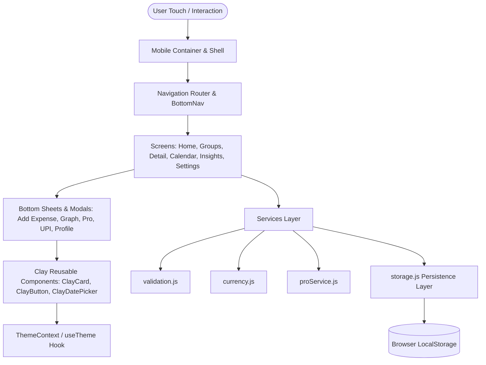
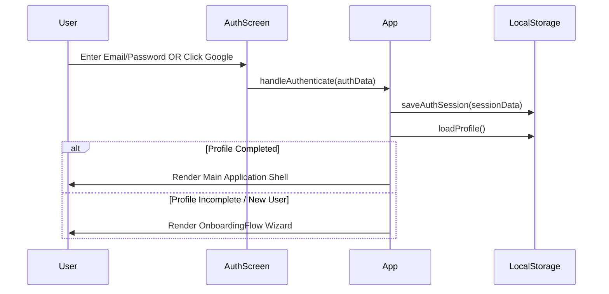
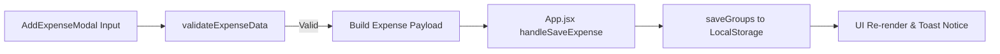
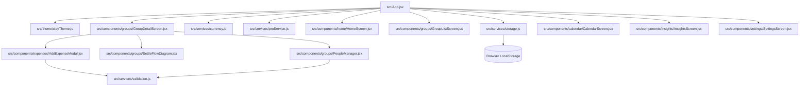
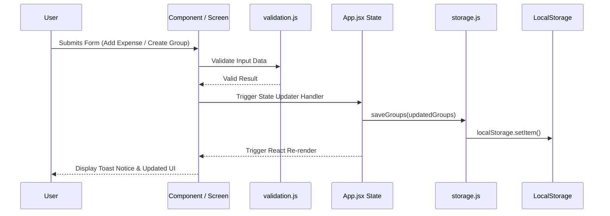

# Splitzy Architecture

## 1. Architecture Overview

Splitzy is a client-side mobile-first web application designed for group expense tracking, bill splitting, smart debt simplification, and direct UPI settlements. It operates as a Single-Page Application (SPA) built with modern web technologies and simulates a client-persistent local database architecture.

### Current Technology Stack

| Layer | Technology |
| :--- | :--- |
| **Application Type** | Single-Page Application (SPA) / Mobile Web App |
| **Frontend Framework** | React 18.2.0 |
| **Build Tool / Bundler** | Vite 5.1.6 (Bundled with Rollup 4) |
| **Language** | JavaScript (ES6+ / JSX) |
| **Styling Approach** | Soft 3D Claymorphic CSS + Dynamic Theme Context Tokens + Inline React Styles |
| **State Management** | React Context API (`ThemeContext`) + Top-level `App.jsx` React State |
| **Navigation** | Custom Tab & Sub-screen State-driven Router (`App.jsx` activeTab & selectedGroupId) |
| **Backend & Persistence**| Browser `localStorage` (Simulated JSON persistence service layer) |
| **Authentication** | Simulated Local Session Auth (Email/Password & Google OAuth credentials) |
| **Integrations** | Native UPI Deep Linking (`upi://pay`), WhatsApp API sharing (`api.whatsapp.com`) |
| **Icon Library** | Lucide React (`lucide-react` v0.344.0) |

### High-Level Architecture Diagram



---

## 2. Frontend Architecture

### 2.1 Frontend Technology
- **Framework**: React 18.2.0 (`react`, `react-dom`)
- **Language**: JavaScript (ES modules, JSX syntax)
- **UI & Styling System**: Custom Claymorphism with `getThemeTokens(mode)` providing dynamic tokens for light (`#EEF3F8`) and dark (`#0B1120`) themes.
- **Routing & Navigation**: State-based view routing managed in `App.jsx` via `activeTab` and `selectedGroupId`.
- **Form Handling & Validation**: Controlled React form components backed by pure utility functions in `src/services/validation.js`.
- **Chart / Graph Implementation**: Custom SVG & pure CSS progress bars in `MonthlyGraphModal.jsx` and `InsightsScreen.jsx` without heavy external chart libraries.
- **Calendar Implementation**: Custom grid-based calendar component in `CalendarScreen.jsx` and `ClayDatePicker.jsx`.
- **Icon Library**: `lucide-react` (v0.344.0).

### 2.2 Frontend Folder Structure

```
src/
├── App.jsx                       # Master Root Application, View Router & State Orchestrator
├── main.jsx                      # Vite Application Entry Point & React DOM Mount
├── components/                   # UI Components Directory
│   ├── auth/                     # Authentication & Landing Flow Components
│   │   ├── AuthScreen.jsx        # Login & Signup Form with Email/Google Auth
│   │   └── LandingAnimation.jsx  # Hero Splash Screen with Floating Coin Physics
│   ├── calendar/                 # Calendar Feature
│   │   └── CalendarScreen.jsx    # Monthly Expense Calendar & Daily Breakdown View
│   ├── common/                   # Reusable Design System Primitives
│   │   ├── BottomSheet.jsx       # Sliding Bottom Drawer Modal Container
│   │   ├── ClayButton.jsx        # Soft 3D Claymorphic Tactile Button
│   │   ├── ClayCard.jsx          # Soft 3D Claymorphic Card Surface
│   │   ├── ClayDatePicker.jsx    # Custom Month/Year Grid Date Picker
│   │   ├── MobileContainer.jsx   # Desktop Phone Mockup Frame & Responsive Wrapper
│   │   └── Toast.jsx             # Top Floating Alert Banner Notification
│   ├── expenses/                 # Expense Management Components
│   │   ├── AddExpenseModal.jsx   # Multi-split Expense Creator & Editor
│   │   ├── ExpenseCard.jsx       # Individual Expense Feed Item Card
│   │   └── RecurringSection.jsx  # Recurring Monthly Bills Management Section
│   ├── groups/                   # Group Management Components
│   │   ├── CreateGroupModal.jsx  # Group Creation Sheet
│   │   ├── GroupDetailScreen.jsx # Single Group Detail View & Expense Feed
│   │   ├── GroupListScreen.jsx   # All Groups Feed, Search & Filter Controls
│   │   ├── PeopleManager.jsx     # Member Avatars, Renaming & Removal
│   │   └── SettleFlowDiagram.jsx # Debt Path SVG Flowchart & Settle Actions
│   ├── home/                     # Home Dashboard Feature
│   │   ├── HomeScreen.jsx        # Dashboard Summary, Net Balance & Quick Actions
│   │   └── MonthlyGraphModal.jsx # Dedicated Monthly Spending Graph Sheet
│   ├── insights/                 # Analytics Feature
│   │   └── InsightsScreen.jsx    # Category Breakdowns, Owed/Owe Totals & Pro Analytics
│   ├── navigation/               # Navigation Bar Components
│   │   └── BottomNav.jsx         # 5-Tab Fixed Bottom Navigation Bar
│   ├── onboarding/               # User Onboarding Flow
│   │   └── OnboardingFlow.jsx    # 6-Step Initial Setup (Name, Birthday, Theme, Currency, Avatar)
│   ├── pro/                      # Premium Features & Payment Modals
│   │   ├── GroupLinkModal.jsx    # Group Share Link Generator & WhatsApp Invite
│   │   ├── ProUpgradeModal.jsx   # Splitzy Pro Upgrade Pass Sheet
│   │   └── UPIPaymentModal.jsx   # Instant UPI Payment Sheet & QR Code Generator
│   ├── roommate/                 # Household Feature
│   │   └── RoommateMode.jsx      # Flatmate Hub for Monthly Household Shares
│   └── settings/                 # User Preferences & Profile
│       ├── EditProfileModal.jsx  # Profile Editor Modal
│       └── SettingsScreen.jsx    # Settings Feed, Appearance Switcher & Data Reset
├── services/                     # Business Logic & Data Services Layer
│   ├── currency.js               # Multi-currency Exchange Rates, Formatting & Conversions
│   ├── proService.js             # Free vs Pro Tier Limits Guardrails
│   ├── storage.js                # LocalStorage Engine, Seed Generator & Debt Simplifier
│   └── validation.js             # Expense & Member Operation Validation Rules
└── theme/                        # Styling & Theme Tokens System
    └── clayTheme.js              # Palette Tokens, Shadows, Context & Global CSS
```

### 2.3 Application Entry Point

The startup sequence follows this execution flow:
1. **`index.html`**: Loads HTML shell, Google Fonts (`Plus Jakarta Sans` and `Space Grotesk`), and scripts `/src/main.jsx`.
2. **`src/main.jsx`**: Initializes `ReactDOM.createRoot` and mounts `<App />` inside `<React.StrictMode>`.
3. **`src/App.jsx`**:
   - Executes initial state initializers:
     - `loadAuthSession()`: Checks for active user session in `localStorage`.
     - `loadProfile()`: Loads user profile details.
     - `loadStoredTheme()`: Resolves light/dark appearance preference.
     - `loadGroups(youName, homeCurrency)`: Retrieves saved groups or generates default seed data.
   - Wraps the application output inside `<ThemeProvider themeMode={themeMode} setThemeMode={handleThemeChange}>`.
   - Renders top-level global `<Toast />` banner container.
   - Checks authentication and onboarding stage flags (`authSession` -> `profile.profileCompleted` -> `Main Application`).

---

## 2.4 Screen Architecture

### 1. Landing Screen
- **File**: [`src/components/auth/LandingAnimation.jsx`](file:///c:/Users/Sarthak%20Salvi/.gemini/antigravity/scratch/Splitzy/src/components/auth/LandingAnimation.jsx)
- **Purpose**: Hero welcome screen showcasing Splitzy brand identity.
- **Entry**: Rendered when `!authSession` and `authStage === "landing"`.
- **Components Used**: `ClayButton`, `lucide-react` (`Coins`, `ArrowRight`).
- **User Actions**: Tap `Get Started` -> advances `authStage` to `"login"`.

### 2. Authentication Screen
- **File**: [`src/components/auth/AuthScreen.jsx`](file:///c:/Users/Sarthak%20Salvi/.gemini/antigravity/scratch/Splitzy/src/components/auth/AuthScreen.jsx)
- **Purpose**: Authenticate user via Email/Password or simulated Google OAuth.
- **Entry**: Rendered when `!authSession` and `authStage === "login"`.
- **Components Used**: `ClayButton`, Google SVG Icon, `Mail`, `Lock`, `Eye`, `EyeOff`.
- **User Actions**: Enter email & password or tap `Continue with Google` -> triggers `onAuthenticate(authData)`.

### 3. Onboarding Flow
- **File**: [`src/components/onboarding/OnboardingFlow.jsx`](file:///c:/Users/Sarthak%20Salvi/.gemini/antigravity/scratch/Splitzy/src/components/onboarding/OnboardingFlow.jsx)
- **Purpose**: 6-step setup wizard for first-time users.
- **Entry**: Rendered when `authSession && (!profile || !profile.profileCompleted)`.
- **Components Used**: `ProgressDots`, `ClayButton`, `ClayCard`, `ClayDatePicker`, Avatar Grid, Theme Switcher.
- **User Actions**: Step through Name -> Birthday -> Theme -> Currency -> Avatar -> Complete -> triggers `onComplete(profileData)`.

### 4. Home Screen
- **File**: [`src/components/home/HomeScreen.jsx`](file:///c:/Users/Sarthak%20Salvi/.gemini/antigravity/scratch/Splitzy/src/components/home/HomeScreen.jsx)
- **Purpose**: Central dashboard displaying converted overall net balance, 4-column quick action grid, and group list summaries.
- **Entry**: `activeTab === "home"` and `!selectedGroupId`.
- **Components Used**: `ClayCard`, `QuickActionButton`, `TrendingUp`, `TrendingDown`, `CheckCircle2`, Avatar Stacks.
- **User Actions**: Open group details, tap `Graph` (opens Monthly Graph Modal), tap `Group` (opens Create Group Modal), tap `Calendar` / `Insights`.

### 5. Groups List Screen
- **File**: [`src/components/groups/GroupListScreen.jsx`](file:///c:/Users/Sarthak%20Salvi/.gemini/antigravity/scratch/Splitzy/src/components/groups/GroupListScreen.jsx)
- **Purpose**: Search, filter, and browse active groups.
- **Entry**: `activeTab === "groups"` and `!selectedGroupId`.
- **Components Used**: `ClayCard`, `ClayButton`, Search Input, Segmented Filter Control (`All`, `Due Payment`, `Already Paid`), Free Limit Banner.
- **User Actions**: Filter groups, search by group name, select group to view details, create new group.

### 6. Group Detail Screen
- **File**: [`src/components/groups/GroupDetailScreen.jsx`](file:///c:/Users/Sarthak%20Salvi/.gemini/antigravity/scratch/Splitzy/src/components/groups/GroupDetailScreen.jsx)
- **Purpose**: In-depth group view with balance hero, member management, debt flowchart, recurring bills, and expense feed.
- **Entry**: `selectedGroupId !== null`.
- **Components Used**: `ClayCard`, `ClayButton`, `PeopleManager`, `SettleFlowDiagram`, `RecurringSection`, `ExpenseCard`.
- **User Actions**: Add expense, edit expense, delete expense, mark settlement paid, open UPI payment, share join link, delete group.

### 7. Calendar Screen
- **File**: [`src/components/calendar/CalendarScreen.jsx`](file:///c:/Users/Sarthak%20Salvi/.gemini/antigravity/scratch/Splitzy/src/components/calendar/CalendarScreen.jsx)
- **Purpose**: Expense tracking mapped onto a monthly grid calendar with daily expense breakdowns.
- **Entry**: `activeTab === "calendar"` and `!selectedGroupId`.
- **Components Used**: `ClayCard`, Month Navigator Controls, Day Cells, Category Icons.
- **User Actions**: Switch months, select day to inspect expenses.

### 8. Insights Screen
- **File**: [`src/components/insights/InsightsScreen.jsx`](file:///c:/Users/Sarthak%20Salvi/.gemini/antigravity/scratch/Splitzy/src/components/insights/InsightsScreen.jsx)
- **Purpose**: Financial analytics showing total owed vs owe, category spending progress bars, and Splitzy Pro insights.
- **Entry**: `activeTab === "insights"` and `!selectedGroupId`.
- **Components Used**: `ClayCard`, `ClayButton`, Category Progress Bars, Pro Analytics Card.
- **User Actions**: Upgrade to Pro, review category distributions.

### 9. Settings Screen
- **File**: [`src/components/settings/SettingsScreen.jsx`](file:///c:/Users/Sarthak%20Salvi/.gemini/antigravity/scratch/Splitzy/src/components/settings/SettingsScreen.jsx)
- **Purpose**: User profile management, appearance switching, Pro status toggle, and data reset.
- **Entry**: `activeTab === "settings"` and `!selectedGroupId`.
- **Components Used**: `ClayCard`, `ClayButton`, `EditProfileModal`, Logout Confirmation Sheet.
- **User Actions**: Open profile editor, toggle Light/Dark theme, toggle Pro test mode, reset cache, log out.

---

## 2.5 Component Architecture

### Global Reusable Components (`src/components/common/`)
1. **`MobileContainer`**: Wraps the entire screen hierarchy inside a responsive phone mockup (`max-width: 440px`) on desktop and full viewports on mobile devices.
2. **`ClayCard`**: Primary soft 3D surface consuming dynamic theme tokens (`clayRaised`, `clayPressed`, `clayRaisedLg`).
3. **`ClayButton`**: Primary tactile button supporting 5 variants (`primary`, `secondary`, `danger`, `outline`, `text`), 3 sizes (`sm`, `md`, `lg`), and active press physics.
4. **`BottomSheet`**: Sliding bottom drawer overlay with backdrop blur and drag handle.
5. **`ClayDatePicker`**: Grid date picker with month and year dropdowns.
6. **`Toast`**: Top banner notification system.

### Feature & Modal Components
- **`MonthlyGraphModal`**: Monthly expense breakdown bottom sheet.
- **`AddExpenseModal`**: Multi-split expense modal (Equal, Percentage, Itemized).
- **`CreateGroupModal`**: Group creator with currency and roommate options.
- **`UPIPaymentModal`**: Direct UPI settlement modal with QR code and deep links.
- **`ProUpgradeModal`**: Premium pass showcase.
- **`GroupLinkModal`**: Shareable join link generator with WhatsApp export.
- **`SettleFlowDiagram`**: Smart debt path SVG visualization.
- **`PeopleManager`**: Group member management widget.

---

## 2.6 Navigation Architecture

```
App Root State Navigation Tree
├── Auth Unauthenticated Stage (authSession == null)
│   ├── LandingAnimation (authStage === "landing")
│   └── AuthScreen (authStage === "login")
├── Onboarding Stage (!profile.profileCompleted)
│   └── OnboardingFlow (Steps 0 to 5)
└── Main Application Shell (authSession && profileCompleted)
    ├── BottomNav (Fixed 5 Tabs)
    │   ├── Home Tab (activeTab === "home")
    │   ├── Groups Tab (activeTab === "groups")
    │   ├── Calendar Tab (activeTab === "calendar")
    │   ├── Insights Tab (activeTab === "insights")
    │   └── Settings Tab (activeTab === "settings")
    └── Group Detail Sub-view (selectedGroupId !== null)
        └── GroupDetailScreen
```

---

## 3. Frontend State Architecture

### Global State (`src/App.jsx`)
- **`authSession`**: Session metadata `{ email, authType, loggedInAt }`.
- **`profile`**: User details `{ name, email, birthday, theme, homeCurrency, avatarId, profileCompleted, isPro }`.
- **`themeMode`**: Current theme mode (`"light"` or `"dark"`).
- **`groups`**: Array of group objects with embedded members and expense arrays.

### Feature & Modal UI State
- **`activeTab`**: Current primary tab (`"home"`, `"groups"`, `"calendar"`, `"insights"`, `"settings"`).
- **`selectedGroupId`**: ID of currently inspected group or `null`.
- **`showCreateGroup`**, **`showAddExpense`**, **`showMonthlyGraph`**, **`showProUpgrade`**, **`showUPI`**, **`showShareLink`**: Boolean flags controlling BottomSheet visibility.
- **`editingExpense`**: Expense object currently being edited or `null`.
- **`toast`**: Notification object `{ message, type, duration }`.

---

## 4. Authentication Architecture

Splitzy uses a local session authentication model stored in `localStorage` under `splitzy_auth_session_v2`.



---

## 5. Profile Architecture

Profile data is structured as:

```javascript
{
  name: "Sarthak Salvi",
  email: "sarthak@splitzy.app",
  birthday: "2000-01-15",
  theme: "light",
  homeCurrency: "INR",
  avatarId: "avatar_cool",
  profileCompleted: true,
  isPro: false
}
```

- Synchronized in `localStorage` under `STORAGE_KEYS.PROFILE` (`splitzy_user_profile_v2`).
- Managed via `loadProfile()` and `saveProfile()` in `src/services/storage.js`.

---

## 6. Groups Architecture

Groups are stored in an array of objects:

```javascript
{
  id: "g_goa",
  name: "Goa Trip 2026",
  currency: "INR",
  isRoommateGroup: false,
  members: [
    { id: "you", name: "Sarthak", upi: "sarthak@upi" },
    { id: "m_rahul", name: "Rahul", upi: "rahul@upi" }
  ],
  expenses: [...]
}
```

- **Free Tier Limit Guardrails**: Enforced via `checkCanCreateGroup` (Max 5 groups) and `checkCanAddMember` (Max 6 members/group) in `src/services/proService.js`.

---

## 7. Expense Architecture

Expenses support three distinct split types:
1. **Equal (`"equal"`)**: Amount divided evenly across selected `participants` array.
2. **Percentage (`"percentage"`)**: Amount allocated according to percentage map `{ memberId: percentage }` (validated to sum to 100%).
3. **Itemized (`"itemized"`)**: Array of item objects `{ id, name, price, participants }` calculated individually.

### Data Flow for Adding an Expense



---

## 8. Balance & Settlement Architecture

### Debt Simplification Algorithm (`simplifySettlements`)
Splitzy minimizes the total number of transactions required to settle a group using a greedy settlement algorithm in `src/services/storage.js`:

```javascript
export function simplifySettlements(net = {}) {
  const creditors = [];
  const debtors = [];

  Object.entries(net).forEach(([id, amt]) => {
    if (amt > 0.5) creditors.push({ id, amt });
    else if (amt < -0.5) debtors.push({ id, amt: -amt });
  });

  creditors.sort((a, b) => b.amt - a.amt);
  debtors.sort((a, b) => b.amt - a.amt);

  const txns = [];
  let i = 0, j = 0;

  while (i < debtors.length && j < creditors.length) {
    const pay = Math.min(debtors[i].amt, creditors[j].amt);
    txns.push({ from: debtors[i].id, to: creditors[j].id, amount: Math.round(pay) });
    debtors[i].amt -= pay;
    creditors[j].amt -= pay;

    if (debtors[i].amt < 0.5) i++;
    if (creditors[j].amt < 0.5) j++;
  }

  return txns;
}
```

### UPI Intent Deep Links
When settling in INR, Splitzy formats native UPI deep links:
`upi://pay?pa=${payeeUpi}&pn=${payeeName}&am=${amount}&cu=INR&tn=Splitzy expense settlement`

---

## 9. Calendar Architecture

- Map generator in `CalendarScreen.jsx` iterates over all group expenses and indexes them by ISO date string (`YYYY-MM-DD`).
- Days containing expenses feature visual indicator dots.
- Tapping any date filters and displays the exact expenses logged on that day, showing the user's converted personal share.

---

## 10. Graph / Analytics Architecture

- `MonthlyGraphModal.jsx` aggregates all expenses for the selected month across all groups.
- Converts every group currency to the user's default `homeCurrency` via `convertCurrency(amount, fromCode, toCode)`.
- Calculates proportional group spend bars (`amt / maxGroupSpend * 100`) rendered as CSS animated progress bars.

---

## 11. Insights Architecture

- `InsightsScreen.jsx` calculates total receivables (you're owed) vs total payables (you owe) across all groups.
- Renders spending distribution bars by category for the current month.
- Exposes Pro analytics previews for monthly comparison metrics and group rankings.

---

## 12. Theme Architecture

- Theme system is powered by `ThemeProvider` and `useTheme()` in `src/theme/clayTheme.js`.
- Exports theme tokens (`LIGHT_THEME` and `DARK_THEME`).
- Dynamically updates global CSS variables and body background (`#EEF3F8` in light mode, `#0B1120` in dark mode).
- Standardized `useTheme()` hook returns self-referencing tokens (`theme.card`, `theme.text`, `theme.primary`, etc.) for seamless component consumption.

---

## 13. Data Layer & Persistence Architecture

Splitzy uses `localStorage` as its local database engine via `src/services/storage.js`:

| Key | Contents |
| :--- | :--- |
| `splitzy_user_profile_v2` | User Profile JSON object |
| `splitzy_groups_data_v2` | Array of Group JSON objects |
| `splitzy_auth_session_v2` | Session authentication JSON object |
| `splitzy_user_theme_v2` | Active theme string (`"light"` or `"dark"`) |

---

## 14. Data Models

### User Profile
```typescript
interface Profile {
  name: string;
  email: string;
  birthday: string; // YYYY-MM-DD
  theme: "light" | "dark";
  homeCurrency: "INR" | "USD" | "EUR" | "GBP" | "JPY" | "AUD";
  avatarId: string;
  profileCompleted: boolean;
  isPro: boolean;
}
```

### Group
```typescript
interface Group {
  id: string;
  name: string;
  currency: string;
  isRoommateGroup: boolean;
  members: Member[];
  expenses: Expense[];
}
```

### Member
```typescript
interface Member {
  id: string; // "you" or generated "m_{timestamp}"
  name: string;
  upi?: string;
}
```

### Expense
```typescript
interface Expense {
  id: string;
  desc: string;
  category: "Food" | "Travel" | "Rent" | "Utilities" | "Shopping" | "Entertainment" | "Other";
  paidBy: string; // Member ID
  amount: number;
  date: string; // ISO 8601 string
  splitType: "equal" | "percentage" | "itemized";
  participants?: string[]; // Member IDs for equal split
  percentages?: Record<string, number>; // { memberId: percentage }
  items?: ItemizedItem[];
  recurring: boolean;
}
```

---

## 15. API / Service Architecture

### Service Modules

1. **`src/services/storage.js`**:
   - `loadProfile()`, `saveProfile(profile)`
   - `loadGroups(youName, homeCurrency)`, `saveGroups(groups)`
   - `loadAuthSession()`, `saveAuthSession(session)`, `clearAuthSession()`
   - `computeBalances(members, expenses)`: Calculates raw net balances.
   - `simplifySettlements(net)`: Debt simplification algorithm.
   - `getShares(expense)`: Calculates per-person expense shares.

2. **`src/services/currency.js`**:
   - `convertCurrency(amount, fromCode, toCode)`: Converted via static USD exchange rates.
   - `fmtMoney(amount, currencyCode, showSign)`: Formats numbers into localized currency strings (`₹4,500`, `$50`).

3. **`src/services/validation.js`**:
   - `validateExpenseData(data)`: Validates expense description, amount, percentage sums (100%), and itemized rows.
   - `validateRemoveMember(group, memberId)`: Prevents removing members with unpaid expenses or reducing group size below 2.

4. **`src/services/proService.js`**:
   - `checkCanCreateGroup(currentGroupCount, isPro)`: Free tier limit check (Max 5 groups).
   - `checkCanAddMember(currentMemberCount, isPro)`: Free tier limit check (Max 6 members).

---

## 16. Validation Architecture

All user input validation is handled on the client side prior to state mutation:
- **Expense Validation**: Description presence, non-zero amount, percentage split sum to 100%, non-empty itemized rows.
- **Member Removal Validation**: Blocked if member is `"you"`, group size `<= 2`, or member has paid for active expenses.
- **Pro Tier Guardrails**: Group and member caps checked before creation.

---

## 17. Error & Loading Architecture

- **Alert Banners**: Top `<Toast />` notifications present success and error messages (`type: "success" | "error" | "info"`).
- **Inline Input Errors**: Form validation errors render inline under input fields in `theme.coral`.
- **Empty States**: Customized empty card states for empty group lists, date selections without expenses, and zero balances.

---

## 18. Persistence Architecture

- State persistence is synchronized immediately upon mutation via React `useEffect` hooks in `App.jsx`.
- LocalStorage keys use versioned tags (`_v2`) to prevent schema conflicts with legacy versions.

---

## 19. Security Considerations

- App data resides within the user's browser `localStorage`.
- Deep links for UPI payments sanitize VPA and name arguments using `encodeURIComponent`.
- All password inputs support toggle mask controls.

---

## 20. Performance Architecture

- Fast bundler build using Vite 5 (transforms 1500+ modules in < 2.5 seconds).
- Zero third-party heavy canvas or chart dependencies; graphs rendered via native CSS transitions.
- Light production bundle size (~284 kB JS).

---

## 21. Mobile Architecture

- Centered mobile frame container (`MobileContainer.jsx`) with fixed `440px` max-width on desktop.
- Touch-optimized targets with active scale transforms (`active:scale-[0.97]`).
- Bottom sheet overlays with scroll locks and escape key listeners.

---

## 22. External Integrations

1. **UPI Intent Scheme**: Deep links to GPay, PhonePe, Paytm (`upi://pay?pa=...`).
2. **WhatsApp Sharing API**: Group invitation and settlement summary exports (`https://api.whatsapp.com/send?text=...`).
3. **Google Auth**: Simulated OAuth credentials handler.

---

## 23. Environment & Configuration

- **`package.json`**:
  - React 18.2.0
  - Lucide React 0.344.0
  - Vite 5.1.6
- **`index.html`**: Preconnects and loads Google Fonts (`Plus Jakarta Sans` & `Space Grotesk`).

---

## 24. Build & Development Architecture

- **Development Command**: `npm run dev` (Launches Vite dev server on `http://localhost:5173` or next available port).
- **Build Command**: `npm run build` (Compiles optimized production bundle to `dist/`).
- **Preview Command**: `npm run preview` (Previews production build locally).

---

## 25. Dependency Map



---

## 26. Frontend Data Flow



---

## 27. Feature-to-Architecture Map

| Feature | Screens | Components | State Location | Services | Data Persistence |
| :--- | :--- | :--- | :--- | :--- | :--- |
| **Authentication** | `AuthScreen`, `LandingAnimation` | `ClayButton` | `App.jsx` (`authSession`) | `storage.js` | `splitzy_auth_session_v2` |
| **Onboarding** | `OnboardingFlow` | `ClayDatePicker`, Avatar Grid | `OnboardingFlow.jsx` state | `storage.js` | `splitzy_user_profile_v2` |
| **Dashboard** | `HomeScreen` | `ClayCard`, `QuickActionButton` | `App.jsx` (`groups`, `profile`) | `currency.js`, `storage.js` | LocalStorage |
| **Groups Feed** | `GroupListScreen` | `ClayCard`, Filter Segment | `GroupListScreen` (`search`, `filter`) | `proService.js` | LocalStorage |
| **Group Details** | `GroupDetailScreen` | `ExpenseCard`, `PeopleManager` | `App.jsx` (`selectedGroupId`) | `storage.js` | LocalStorage |
| **Add Expense** | `AddExpenseModal` | `BottomSheet`, Category Chips | `AddExpenseModal` form state | `validation.js`, `currency.js` | LocalStorage |
| **Smart Settlement**| `SettleFlowDiagram` | SVG Diagram, `ClayButton` | Computed dynamically | `storage.js` (`simplifySettlements`) | LocalStorage |
| **UPI Payments** | `UPIPaymentModal` | QR Code Box, Deep Link Button | `App.jsx` (`payeeDetails`, `showUPI`) | `currency.js` | LocalStorage |
| **Monthly Graph** | `MonthlyGraphModal` | Spend Progress Bars | `App.jsx` (`showMonthlyGraph`) | `currency.js` | LocalStorage |
| **Calendar View** | `CalendarScreen` | Month Navigator, Day Grid | `CalendarScreen` (`selectedDateStr`) | `currency.js` | LocalStorage |
| **Insights** | `InsightsScreen` | Progress Bars, Pro Card | `InsightsScreen` state | `currency.js` | LocalStorage |
| **Theme System** | `SettingsScreen`, `EditProfileModal` | Theme Buttons, `ThemeProvider` | `App.jsx` (`themeMode`) | `clayTheme.js` | `splitzy_user_theme_v2` |

---

## 28. Future Development Rules

1. **Inspect Before Modifying**: Inspect existing component architectures and service functions before introducing new files or state containers.
2. **Reuse Existing Components**: Use `<ClayCard>`, `<ClayButton>`, and `<BottomSheet>` rather than writing ad-hoc `div` wrappers.
3. **Keep State Centralized**: Maintain groups and user profile as the canonical top-level state in `App.jsx`.
4. **Decouple Business Logic**: Place math calculations, currency conversions, and debt simplifications inside pure service files (`storage.js`, `currency.js`, `validation.js`).
5. **Always Validate Input**: Run form inputs through `validation.js` before calling state updater functions.
6. **Enforce Theme Consistency**: Consume colors and shadows via `useTheme()` to guarantee light and dark mode parity.
7. **Preserve Free vs Pro Limits**: Always check `proService.js` guardrails when creating groups or adding members.
8. **Keep Layout Mobile-First**: Ensure new components fit within the `440px` mobile container layout.
9. **Never Hardcode Exchange Rates in UI**: Perform currency math through `convertCurrency()` and format money through `fmtMoney()`.
10. **Maintain Smooth Touch Physics**: Use active tap scaling (`active:scale-[0.97]`) and cubic-bezier transition curves for new interactive controls.
11. **Avoid Duplicate Libraries**: Do not install external chart or date-picker dependencies when native SVG and CSS solutions already exist in the codebase.
12. **Follow Design System**: Adhere strictly to the aesthetic standards documented in `design.md`.

---

## 29. Known Technical Debt / Architecture Gaps

### Confirmed Architectural Debt
1. **Top-level State Concentration in `App.jsx`**: `App.jsx` manages routing, auth, profile, groups, modals, and toast state in a single file (~430 lines). As features expand, extracting a dedicated `useGroups` custom hook or context wrapper will improve maintainability.
2. **Synchronous Currency Conversion**: Exchange rates in `src/services/currency.js` are static constants (`USD_RATES`). Live real-time currency API synchronization can be integrated in future releases.
3. **SVG Settlement Line Capping**: `SettleFlowDiagram.jsx` renders up to 3 SVG path lines (`settlements.slice(0, 3)`). Additional settlements are displayed exclusively in the transaction list below.

---

## 30. Source-of-Truth Rule

`architecture.md` describes the technical architecture and data flow of Splitzy.

`design.md` describes the visual design system and styling standards of Splitzy.

Future developers and AI coding agents MUST consult these documents before introducing structural or visual changes. However, the actual source code remains authoritative if discrepancies arise due to ongoing development.

---

## 31. Backend Addendum (Task 1 — Backend Foundation)

> **Status: Task 1 complete.** The frontend described above is unchanged — it remains a fully client-side React/Vite SPA with no live API integration. This addendum records the newly created backend foundation only.

### 31.1 Backend Technology

- **Runtime:** Node.js (>= 20)
- **Language:** TypeScript (strict mode)
- **HTTP Framework:** Express 5
- **ORM:** Prisma 6 with a PostgreSQL datasource configured (no models yet — Task 2)
- **Config:** dotenv + validated environment module (`src/config/env.ts`)
- **CORS:** `cors` middleware with an explicit origin allow-list (`CORS_ORIGIN`, comma-separated; `*` is rejected)
- **Tests:** Node.js built-in test runner (`node --test`), zero extra test dependencies

### 31.2 Backend Location & Structure

The backend lives in `Backend/`:

```
Backend/
├── src/
│   ├── config/        # env.ts — validated environment configuration
│   ├── controllers/   # health.controller.ts
│   ├── middleware/    # requestLogger, notFound, errorHandler
│   ├── routes/        # index.ts (/api/v1 registry), health.routes.ts
│   ├── services/      # db.ts — shared lazy Prisma client singleton
│   ├── types/         # api.ts — response envelope types
│   ├── utils/         # appError.ts — AppError class + error code registry
│   ├── app.ts         # Express app factory (no port binding)
│   └── server.ts      # Entry point: listen, error handling, graceful shutdown
├── prisma/
│   └── schema.prisma  # PostgreSQL datasource only, intentionally model-free
├── tests/
│   └── health.test.ts
└── README.md          # Full backend documentation
```

### 31.3 API Conventions

- All endpoints live under `/api/v1` (currently `GET /api/v1/health`).
- Health response (HTTP 200): `{ "success": true, "service": "splitzy-api", "status": "healthy" }`.
- Unknown routes return HTTP 404 `{ "success": false, "error": { "code": "NOT_FOUND", "message": "Route not found" } }`.
- Errors are centralized: services throw `AppError` with stable codes; the handler serializes them into the standard envelope and never leaks internals in production.
- Request logging records method, path, status, duration only — never headers, bodies, tokens or credentials.
- The API starts without a live database; the Prisma client is created lazily on first use.

### 31.4 What Does NOT Exist Yet

Authentication, users, groups, expenses, settlements, payments, subscriptions, and all other business features are **not implemented** — the backend is a foundation only. The frontend-to-backend connection is a later task; until then the frontend continues to use `localStorage` exactly as documented above.

---

## 32. Database Schema Addendum (Task 2 — PostgreSQL + Prisma)

> **Status: Task 2 complete.** Status: **CURRENT** = the React/Vite frontend + the Task 1 backend foundation. **NEW** = the PostgreSQL + Prisma relational schema below. **FUTURE** = authentication, API endpoints, business services, frontend integration. The frontend remains untouched and continues to use `localStorage`.

### 32.1 Technology

- **Database:** PostgreSQL (datasource `provider = "postgresql"`, URL from `DATABASE_URL` — no hard-coded credentials).
- **ORM:** Prisma 6; schema at `Backend/prisma/schema.prisma`; initial migration at `Backend/prisma/migrations/20260918120000_init/`.

### 32.2 Entities

`User`, `Group` (with owner), `GroupMember` (user↔group join with `GroupRole`), `Expense`, `ExpenseParticipant`, `ExpenseItem`, `ExpenseItemParticipant`, `Settlement`, `RecurringExpense`, `RecurringExpenseParticipant` — ten models that mirror the concepts the frontend already models in `localStorage` (groups with members and per-item splits, recurring bills, settlements), restructured as a normalized relational model rather than a copy of the localStorage object shape.

### 32.3 Money, IDs & Integrity

- **Money:** stored as integer **minor units** in `BigInt` `*Minor` columns (`amountMinor`, `shareMinor`) — ₹100.50 → `10050` paise. No floating-point money columns. `currencyCode CHAR(3)` (INR/USD/EUR/GBP/JPY/AUD) is stored alongside every amount; conversion is a future task.
- **IDs:** UUIDs generated by PostgreSQL (`gen_random_uuid()`) — no sequential public IDs.
- **Delete behavior:** CASCADE for owned child data (group → expenses/settlements/members), **RESTRICT** on a group's owner (a group can never lose its owner), **SET NULL** for financial attribution (`Expense.paidBy`, `Settlement.fromUser/toUser`, participants) so deleting a user preserves financial history.
- **Constraints:** unique email, unique `(groupId, userId)` membership, unique participant pairs per expense/recurring expense, `Decimal(5,2)` percentages.
- **Indexes:** all FKs used in queries plus `Expense (groupId, expenseDate)` feeds and `RecurringExpense.nextRunAt` for the future scheduler.
- **Enums:** `GroupRole`, `SplitType`, `SettlementStatus`, `PaymentMethod`, `RecurringFrequency`. Expense categories (Food, Travel, Rent, Utilities, Shopping, Entertainment, Other — the frontend's exact set) are plain text to keep category extension migration-free.
- **Settlements are first-class**, separate from `Expense`; recurring expenses are templates with their own participant configuration, materialized by a future scheduler.

### 32.4 What the Database Does NOT Include Yet

No credential/password columns (Task 3 decides password storage), no seed data, and no queries — no application code reads from or writes to the database yet. Currency conversion, split-calculation services, and all business APIs are future tasks.
